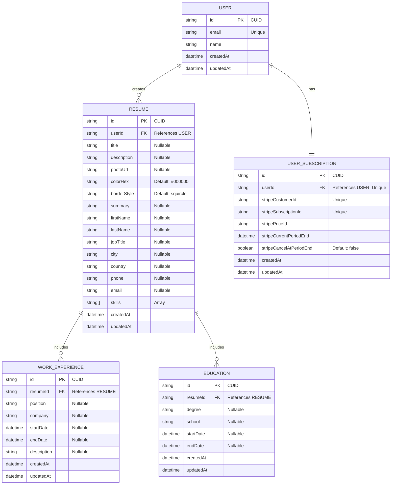
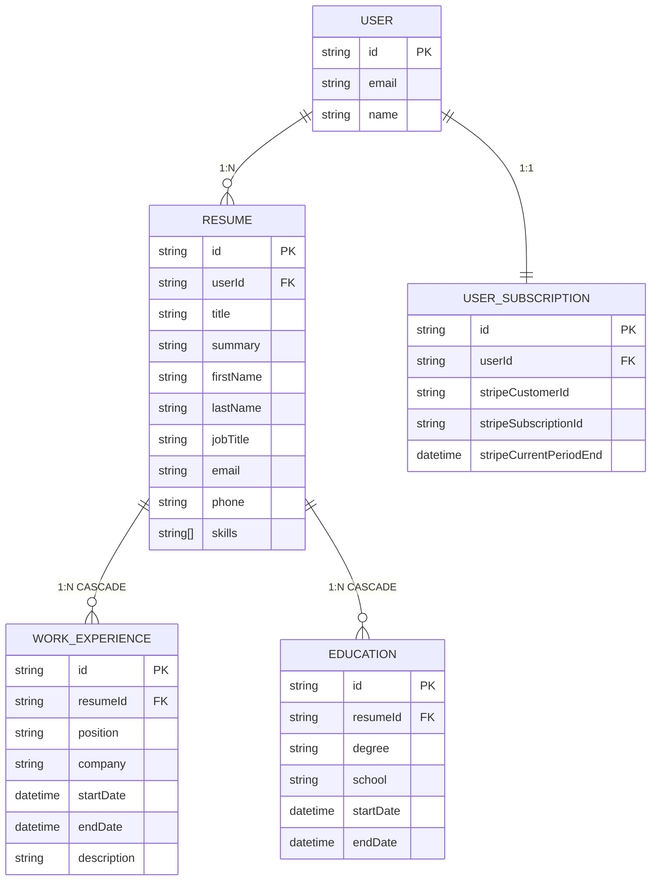

# Entity Relationship Diagram - Mermaid Code

## Mermaid ER Diagram



## Alternative Mermaid ERD (Simplified)



## Class Diagram Alternative

```mermaid
classDiagram
    class User {
        +String id
        +String email
        +String name
        +DateTime createdAt
        +DateTime updatedAt
    }
    
    class Resume {
        +String id
        +String userId
        +String title
        +String description
        +String photoUrl
        +String colorHex
        +String borderStyle
        +String summary
        +String firstName
        +String lastName
        +String jobTitle
        +String city
        +String country
        +String phone
        +String email
        +String[] skills
        +DateTime createdAt
        +DateTime updatedAt
    }
    
    class WorkExperience {
        +String id
        +String resumeId
        +String position
        +String company
        +DateTime startDate
        +DateTime endDate
        +String description
        +DateTime createdAt
        +DateTime updatedAt
    }
    
    class Education {
        +String id
        +String resumeId
        +String degree
        +String school
        +DateTime startDate
        +DateTime endDate
        +DateTime createdAt
        +DateTime updatedAt
    }
    
    class UserSubscription {
        +String id
        +String userId
        +String stripeCustomerId
        +String stripeSubscriptionId
        +String stripePriceId
        +DateTime stripeCurrentPeriodEnd
        +Boolean stripeCancelAtPeriodEnd
        +DateTime createdAt
        +DateTime updatedAt
    }
    
    User ||--o{ Resume : creates
    User ||--|| UserSubscription : subscribes
    Resume ||--o{ WorkExperience : includes
    Resume ||--o{ Education : includes
```

## Usage Instructions

### For GitHub/GitLab/Documentation:
1. Copy any of the mermaid code blocks above
2. Paste into your markdown files
3. The diagram will render automatically

### For Mermaid Live Editor:
1. Visit https://mermaid.live
2. Paste the code to see live preview
3. Export as PNG/SVG if needed

### Recommended Version:
The **first ERD version** is recommended as it:
- ✅ Shows all field details and constraints
- ✅ Includes data types and default values
- ✅ Shows nullable fields clearly
- ✅ Displays all relationship cardinalities
- ✅ Most comprehensive and professional

### Key Features Highlighted:
- **Primary Keys (PK)**: All entities use CUID strings
- **Foreign Keys (FK)**: Clear references between entities
- **Unique Constraints**: Shown on UserSubscription fields
- **Cascade Deletes**: WorkExperience and Education delete with Resume
- **Default Values**: colorHex, borderStyle, stripeCancelAtPeriodEnd
- **Nullable Fields**: Marked with "Nullable" annotation