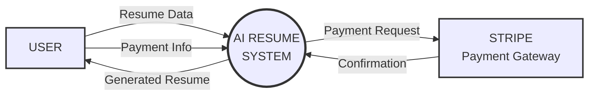
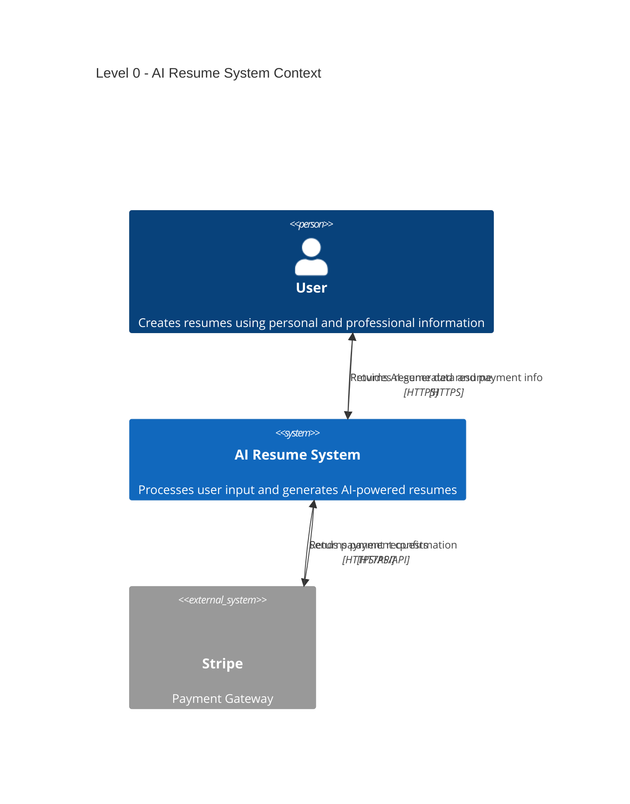

# Level 0 DFD - AI Resume System (Mermaid Code)

## Mermaid Flowchart Code

```mermaid
flowchart TD
    %% External Entities
    User[🧑‍💼 USER<br/>External Entity]
    Stripe[💳 STRIPE<br/>Payment Gateway<br/>External Entity]
    
    %% Main Process
    AISystem((AI RESUME<br/>SYSTEM<br/>Process 0.0))
    
    %% Data Flows
    User -->|1. Resume Input Data<br/>(Personal details, experience, education)| AISystem
    User -->|2. Subscription/Payment Info| AISystem
    AISystem -->|3. Payment Request<br/>(Subscription info)| Stripe
    Stripe -->|4. Payment Status<br/>(Confirmation)| AISystem
    AISystem -->|5. AI-powered Resume| User
    
    %% Styling
    classDef externalEntity fill:#e8f4f8,stroke:#2c5aa0,stroke-width:2px,color:#000
    classDef process fill:#f0f8e8,stroke:#4a7c59,stroke-width:3px,color:#000
    classDef paymentEntity fill:#fff2e8,stroke:#d97706,stroke-width:2px,color:#000
    
    class User externalEntity
    class Stripe paymentEntity
    class AISystem process
```

## Alternative Mermaid Graph Code (Simplified)



## Mermaid C4 Context Diagram (Alternative Approach)



## Usage Instructions

1. **For GitHub/GitLab**: Copy any of the mermaid code blocks above and paste them into your markdown files
2. **For Mermaid Live Editor**: Visit https://mermaid.live and paste the code
3. **For Documentation Platforms**: Most platforms like GitBook, Notion, etc. support Mermaid diagrams

## Recommended Version

The **first flowchart version** is recommended as it:
- Shows clear data flow directions
- Includes detailed labels for each flow
- Uses proper DFD conventions
- Has visual styling to distinguish entity types
- Is most readable and professional