# Use Case Diagram - AI-Powered Resume SaaS

## Mermaid Use Case Diagram

```mermaid
graph TB
    %% Actors
    User((User))
    Admin((Admin))
    AIService[AI Service<br/>External System]
    StripeAPI[Stripe API<br/>External System]
    
    %% System Boundary
    subgraph "AI Resume SaaS System"
        %% Authentication Use Cases
        UC1[Register Account]
        UC2[Login/Logout]
        UC3[Reset Password]
        UC4[Update Profile]
        
        %% Resume Management Use Cases
        UC5[Create Resume]
        UC6[Edit Resume]
        UC7[Delete Resume]
        UC8[View Resume List]
        UC9[Preview Resume]
        UC10[Download Resume]
        UC11[Share Resume]
        
        %% AI Enhancement Use Cases
        UC12[Generate AI Content]
        UC13[Optimize Resume Text]
        UC14[Suggest Improvements]
        UC15[Auto-format Content]
        
        %% Subscription & Payment Use Cases
        UC16[View Pricing Plans]
        UC17[Subscribe to Plan]
        UC18[Manage Subscription]
        UC19[Cancel Subscription]
        UC20[Process Payment]
        UC21[Handle Payment Webhooks]
        
        %% Form Management Use Cases
        UC22[Fill Personal Details]
        UC23[Add Work Experience]
        UC24[Add Education]
        UC25[Add Skills]
        UC26[Validate Form Data]
        
        %% System Administration Use Cases
        UC27[Monitor System]
        UC28[Manage Users]
        UC29[View Analytics]
        UC30[Configure AI Settings]
        UC31[Manage Subscriptions]
    end
    
    %% User Relationships
    User --> UC1
    User --> UC2
    User --> UC3
    User --> UC4
    User --> UC5
    User --> UC6
    User --> UC7
    User --> UC8
    User --> UC9
    User --> UC10
    User --> UC11
    User --> UC12
    User --> UC13
    User --> UC14
    User --> UC15
    User --> UC16
    User --> UC17
    User --> UC18
    User --> UC19
    User --> UC22
    User --> UC23
    User --> UC24
    User --> UC25
    
    %% Admin Relationships
    Admin --> UC27
    Admin --> UC28
    Admin --> UC29
    Admin --> UC30
    Admin --> UC31
    
    %% External System Relationships
    UC12 --> AIService
    UC13 --> AIService
    UC14 --> AIService
    UC15 --> AIService
    UC17 --> StripeAPI
    UC18 --> StripeAPI
    UC19 --> StripeAPI
    UC20 --> StripeAPI
    UC21 --> StripeAPI
    
    %% Include Relationships
    UC5 -.->|includes| UC22
    UC5 -.->|includes| UC23
    UC5 -.->|includes| UC24
    UC5 -.->|includes| UC25
    UC5 -.->|includes| UC26
    UC6 -.->|includes| UC26
    UC17 -.->|includes| UC20
    
    %% Extend Relationships
    UC13 -.->|extends| UC5
    UC14 -.->|extends| UC6
    UC15 -.->|extends| UC9
    
    %% Styling
    classDef actor fill:#e1f5fe,stroke:#01579b,stroke-width:2px,color:#000
    classDef usecase fill:#f3e5f5,stroke:#4a148c,stroke-width:1px,color:#000
    classDef external fill:#fff3e0,stroke:#e65100,stroke-width:2px,color:#000
    classDef system fill:#e8f5e8,stroke:#2e7d32,stroke-width:3px,color:#000
    
    class User,Admin actor
    class AIService,StripeAPI external
    class UC1,UC2,UC3,UC4,UC5,UC6,UC7,UC8,UC9,UC10,UC11,UC12,UC13,UC14,UC15,UC16,UC17,UC18,UC19,UC20,UC21,UC22,UC23,UC24,UC25,UC26,UC27,UC28,UC29,UC30,UC31 usecase
```

## Detailed Use Case Descriptions

### Authentication & User Management

| Use Case | Description | Preconditions | Postconditions |
|----------|-------------|---------------|----------------|
| **Register Account** | User creates new account with email/password | User has valid email | User account created, verification email sent |
| **Login/Logout** | User authenticates to access system | User has valid credentials | User session established/terminated |
| **Reset Password** | User recovers forgotten password | User has registered email | Password reset link sent |
| **Update Profile** | User modifies account information | User is authenticated | Profile information updated |

### Resume Management

| Use Case | Description | Preconditions | Postconditions |
|----------|-------------|---------------|----------------|
| **Create Resume** | User builds new resume from scratch | User is authenticated | New resume created with basic structure |
| **Edit Resume** | User modifies existing resume content | Resume exists, user owns it | Resume content updated |
| **Delete Resume** | User removes resume permanently | Resume exists, user owns it | Resume deleted from system |
| **View Resume List** | User sees all their created resumes | User is authenticated | List of user's resumes displayed |
| **Preview Resume** | User views formatted resume | Resume exists | Formatted resume displayed |
| **Download Resume** | User exports resume as PDF/DOCX | Resume exists, user has subscription | Resume file downloaded |
| **Share Resume** | User generates shareable link | Resume exists | Public link created |

### AI Enhancement Features

| Use Case | Description | Preconditions | Postconditions |
|----------|-------------|---------------|----------------|
| **Generate AI Content** | AI creates resume sections | User has active subscription, AI service available | AI-generated content added to resume |
| **Optimize Resume Text** | AI improves existing content | Content exists, AI service available | Content enhanced and optimized |
| **Suggest Improvements** | AI provides recommendations | Resume content exists | Suggestions displayed to user |
| **Auto-format Content** | AI formats content professionally | Content exists | Content formatted according to best practices |

### Subscription & Payment

| Use Case | Description | Preconditions | Postconditions |
|----------|-------------|---------------|----------------|
| **View Pricing Plans** | User sees available subscription tiers | None | Pricing information displayed |
| **Subscribe to Plan** | User purchases subscription | User authenticated, valid payment method | Subscription activated |
| **Manage Subscription** | User modifies subscription settings | Active subscription exists | Subscription settings updated |
| **Cancel Subscription** | User terminates subscription | Active subscription exists | Subscription cancelled |
| **Process Payment** | System handles payment transaction | Valid payment information | Payment processed successfully |
| **Handle Payment Webhooks** | System processes Stripe events | Webhook received from Stripe | System state updated |

### Form Management

| Use Case | Description | Preconditions | Postconditions |
|----------|-------------|---------------|----------------|
| **Fill Personal Details** | User enters basic information | Resume creation in progress | Personal details saved |
| **Add Work Experience** | User adds job history | Resume exists | Work experience entry added |
| **Add Education** | User adds educational background | Resume exists | Education entry added |
| **Add Skills** | User lists professional skills | Resume exists | Skills list updated |
| **Validate Form Data** | System checks data integrity | Form data submitted | Data validated and errors shown |

## System Actors

### Primary Actors
1. **User (End Customer)**
   - Individuals seeking to create professional resumes
   - Primary beneficiary of the system
   - Interacts with most use cases

2. **Admin (System Administrator)**
   - Manages system operations and user accounts
   - Monitors system performance and analytics
   - Configures AI and subscription settings

### Secondary Actors (External Systems)
1. **AI Service (ChatGPT/OpenAI)**
   - Provides content generation and optimization
   - External dependency for AI features
   - Rate-limited and API-key protected

2. **Stripe API**
   - Handles payment processing and subscription management
   - External payment gateway
   - Webhook-driven event processing

## Use Case Relationships

### Include Relationships
- **Create Resume** includes form filling use cases (personal details, work experience, education, skills)
- **Subscribe to Plan** includes payment processing
- Form validation is included in all data entry use cases

### Extend Relationships
- AI enhancement features extend core resume creation/editing functionality
- Advanced formatting extends basic preview functionality
- Premium features extend based on subscription status

### Dependency Relationships
- Most features depend on user authentication
- AI features depend on active subscription
- Payment features depend on Stripe integration
- Content generation depends on AI service availability

## Business Rules

1. **Subscription Requirements**
   - AI features require active subscription
   - Free tier allows basic resume creation
   - Premium features locked behind paywall

2. **Data Ownership**
   - Users own their resume data
   - Data deletion removes all associated content
   - Shared resumes maintain access controls

3. **Rate Limiting**
   - AI requests limited per subscription tier
   - API calls throttled to prevent abuse
   - Fair usage policies enforced

4. **Security Requirements**
   - All user data encrypted
   - Payment information handled by Stripe
   - Access control enforced on all operations